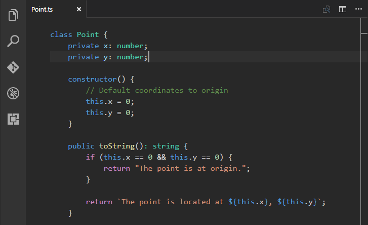
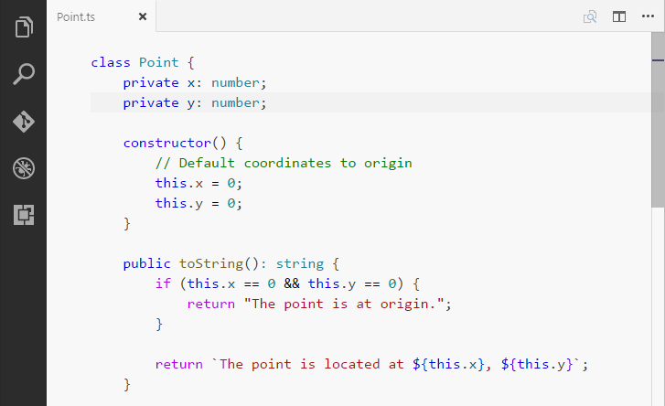

# Mild Default Theme

A Visual Studio Code set of themes based on the default themes, but with a milder contrast. 
I really like the default themes, but find the dark / light contrast a bit too high - for instance, in the Dark themes,
the white text seems to 'bloom' and is a bit tiring, so this is my attempt to fix that.

